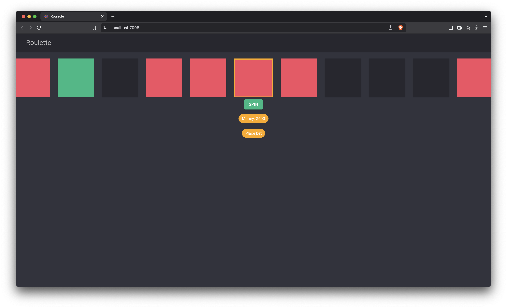

# BlazorRoulette 🎰

BlazorRoulette is a simple roulette application built with **.NET 9**, **Blazor**, and **MudBlazor 8.3.0**. This project was created for fun and serves as an interesting exercise in developing interactive applications with Blazor.

## 🚀 Features
- Roulette game with a modern UI
- Place bets on colors (red, green, black)
- Virtual money system for testing

## 📸 Screenshots



## 🛠️ Technologies Used
- **.NET 9**
- **Blazor Server**
- **MudBlazor 8.3.0**

## 🔧 Installation & Running Locally

1. Clone the repository:
   ```sh
   git clone https://github.com/user/BlazorRoulette.git
   cd BlazorRoulette
   ```
2. Run the application:
   ```sh
   dotnet run
   ```
3. Open your browser and go to `http://localhost:7008`

## 🌍 Online Demo (Coming Soon)
A live demo will be available soon, stay tuned! 🚀

## 📢 Contribute & Feedback
This is a personal project, but I’m open to suggestions! If you have ideas for improvements, feel free to open an issue or a pull request. You can also leave feedback on **LinkedIn**! 🙌

---

🎯 **Enjoy and happy spinning!**

